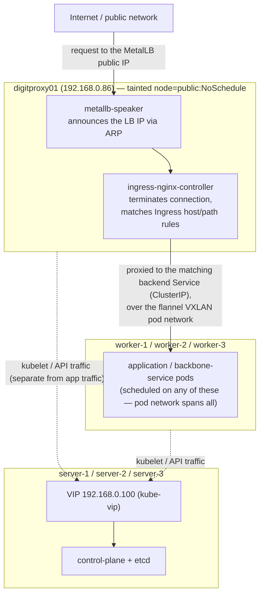

# k3s HA cluster — 3 masters + 3 workers with kube-vip (manual steps)

Highly available k3s cluster: 3 server (master) nodes with embedded etcd,
3 agent (worker) nodes, control plane fronted by a kube-vip virtual IP.
All commands below are run directly on the nodes — no extra scripts needed.

## Cluster plan

| Node     | Role                       | IP           |
|----------|----------------------------|--------------|
| —        | VIP (virtual, no machine)  | 192.168.0.100 |
| server-1 | master (bootstrap)         | 192.168.0.80 |
| server-2 | master                     | 192.168.0.81 |
| server-3 | master                     | 192.168.0.82 |
| worker-1 | agent                      | 192.168.0.83 |
| worker-2 | agent                      | 192.168.0.84 |
| worker-3 | agent                      | 192.168.0.85 |
| digitproxy01 | agent (public/edge node) | 192.168.0.86 |

Replace the IPs with your own. The VIP must be a FREE, unused IP on the
same subnet as the servers, excluded from your DHCP range.

## Architecture — node roles & traffic flow

There are two separate concerns here, handled by two different nodes/IPs —
don't confuse them:

- **VIP (192.168.0.100, kube-vip)** — control-plane HA only. This is how
  `kubectl`/`kubelet`/the API server are reached; it floats across
  server-1..3 via ARP. It has nothing to do with application traffic.
- **digitproxy01 (192.168.0.86)** — the public data-plane entry point.
  It's the only node with a route to/from the public network, so it's
  tainted/labeled (`node=public`, see Step 8) and dedicated to running
  MetalLB's speaker + the ingress-nginx controller, which are the only
  things that need to be reachable from outside.

| Node                    | IP            | Role                                    | Purpose                                                                 |
|-------------------------|---------------|------------------------------------------|--------------------------------------------------------------------------|
| — (VIP, virtual)        | 192.168.0.100 | control-plane HA endpoint                 | kube-vip ARP-floats across server-1..3; all API/kubectl traffic targets this, never an individual server IP |
| server-1                | 192.168.0.80  | master (bootstrap)                        | control-plane + etcd (quorum member); runs kube-vip                     |
| server-2                | 192.168.0.81  | master                                    | control-plane + etcd (quorum member); runs kube-vip                     |
| server-3                | 192.168.0.82  | master                                    | control-plane + etcd (quorum member); runs kube-vip                     |
| worker-1 / -2 / -3      | .83 / .84 / .85 | agent                                    | run application/backbone-service pods; internal-only, no public route   |
| digitproxy01            | 192.168.0.86  | agent, public/edge (tainted `node=public`) | only node reachable from the public network; runs metallb `speaker` + `ingress-nginx` controller so all external traffic enters here |

Traffic flow, external request in:

Both `metallb` (`controller`+`speaker`) and `ingress-nginx` (`controller`)
have matching `nodeSelector: {node: public}` + `tolerations` in their
`values.yaml` under `deploy-as-code/helm/charts/backbone-services/`, so
they land on `digitproxy01` and nowhere else.

## Step 0 — Prepare all 6 nodes

On EVERY node:

    # unique hostname per machine (server-1, server-2, ... worker-3)
    sudo hostnamectl set-hostname server-1

    sudo apt update && sudo apt upgrade -y

    # lab: disable firewall
    # production: open 6443/tcp, 2379-2380/tcp, 10250/tcp, 8472/udp instead
    sudo systemctl disable --now ufw 2>/dev/null || true

Find the network interface name on the servers (needed in Step 1):

    ip route get 1.1.1.1 | awk '{print $5; exit}'
    # e.g. eth0, ens18, enp0s3 ...

Generate a join token once (use the same value on all 6 nodes):

    openssl rand -hex 16
    # example output (for dev): 6da3716dcf49080f418c0005e6b38e65

## Step 1 — On server-1: stage kube-vip manifests (BEFORE installing k3s)

k3s auto-deploys anything in its manifests directory, so kube-vip comes
up together with the cluster.

    sudo mkdir -p /var/lib/rancher/k3s/server/manifests

    # kube-vip RBAC
    sudo curl -sL https://kube-vip.io/manifests/rbac.yaml \
      -o /var/lib/rancher/k3s/server/manifests/kube-vip-rbac.yaml

Create the kube-vip DaemonSet — EDIT the two values `address`
(your VIP) and `vip_interface` (your NIC from Step 0):

    sudo tee /var/lib/rancher/k3s/server/manifests/kube-vip.yaml > /dev/null <<'EOF'
    apiVersion: apps/v1
    kind: DaemonSet
    metadata:
      name: kube-vip-ds
      namespace: kube-system
    spec:
      selector:
        matchLabels:
          name: kube-vip-ds
      template:
        metadata:
          labels:
            name: kube-vip-ds
        spec:
          hostNetwork: true
          serviceAccountName: kube-vip
          nodeSelector:
            node-role.kubernetes.io/control-plane: "true"
          tolerations:
            - effect: NoSchedule
              operator: Exists
            - effect: NoExecute
              operator: Exists
          containers:
            - name: kube-vip
              image: ghcr.io/kube-vip/kube-vip:v0.8.9
              imagePullPolicy: IfNotPresent
              args: ["manager"]
              env:
                - name: vip_arp
                  value: "true"
                - name: address
                  value: "192.168.0.100"
                - name: vip_interface
                  value: "ens160"
                - name: port
                  value: "6443"
                - name: cp_enable
                  value: "true"
                - name: svc_enable
                  value: "false"
                - name: vip_leaderelection
                  value: "true"
                - name: vip_leaseduration
                  value: "5"
                - name: vip_renewdeadline
                  value: "3"
                - name: vip_retryperiod
                  value: "1"
              securityContext:
                capabilities:
                  add: ["NET_ADMIN", "NET_RAW"]
    EOF

## Step 2 — Install k3s on server-1

    curl -sfL https://get.k3s.io | sh -s - server \
      --cluster-init \
      --token=6da3716dcf49080f418c0005e6b38e65 \
      --tls-san=192.168.0.100

`--tls-san` puts the VIP into the API certificate — mandatory,
otherwise TLS connections to the VIP are rejected.

Wait ~60 seconds, then verify. DO NOT CONTINUE until all three pass:

    sudo k3s kubectl get nodes                                  # node Ready?
    sudo k3s kubectl get pods -n kube-system | grep kube-vip    # pod Running?
    curl -k https://192.168.0.100:6443/ping                      # expect: pong

## Step 3 — Join server-2 and server-3 (via the VIP)

On server-2, then server-3:

    curl -sfL https://get.k3s.io | sh -s - server \
      --server https://192.168.0.100:6443 \
      --token=6da3716dcf49080f418c0005e6b38e65 \
      --tls-san=192.168.0.100

Verify from server-1 (expect 3 servers, 3 kube-vip pods):

    sudo k3s kubectl get nodes
    sudo k3s kubectl get pods -n kube-system -o wide | grep kube-vip

## Step 4 — Join the 3 workers (via the VIP)

On worker-1, worker-2, worker-3:

    curl -sfL https://get.k3s.io | sh -s - agent \
      --server https://192.168.0.100:6443 \
      --token=6da3716dcf49080f418c0005e6b38e65

## Step 5 — Verify the full cluster

From any server:

    sudo k3s kubectl get nodes -o wide

Expected: 6 nodes Ready — 3 with `control-plane,etcd,master` roles,
3 workers. Optional worker labels:

    sudo k3s kubectl label node worker-1 worker-2 worker-3 \
      node-role.kubernetes.io/worker=worker

## Step 6 — kubectl from your laptop (via the VIP)

    # on server-1
    sudo cat /etc/rancher/k3s/k3s.yaml

Save as `~/.kube/config` on your machine and change:

    server: https://127.0.0.1:6443
    # to:
    server: https://192.168.0.100:6443

Test: `kubectl get nodes`

## Step 7 — Prove the HA works (optional but recommended)

Find which server currently holds the VIP:

    ip addr | grep 192.168.0.100        # run on each server

Power that server off, then from your laptop:

    while true; do kubectl get nodes 2>&1 | head -1; sleep 2; done

A few seconds of connection errors, then it recovers — the VIP has moved
to a surviving server. Power the dead server back on; it rejoins
automatically.

## Step 8 — Taint and label the public/edge node

We use MetalLB to hand out a LoadBalancer IP on our public network, and we
want that traffic (and the ingress-nginx controller that receives it) to
land on one dedicated, internet-facing node instead of any random worker.
Do this for the node that's actually reachable from the public network —
for our dev cluster that's `digitproxy01` (192.168.0.86):

    kubectl taint node digitproxy01 node=public:NoSchedule
    kubectl label node digitproxy01 node=public

- The **taint** (`NoSchedule`) keeps normal workloads off this node by
  default, since it's directly exposed to public traffic.
- The **label** (`node=public`) is what metallb's `controller`/`speaker`
  and ingress-nginx's `controller` match on via `nodeSelector`, combined
  with a matching `tolerations` entry so they're still allowed to schedule
  there despite the taint (see `values.yaml` in the `metallb` and
  `ingress-nginx` backbone-services charts).

## Troubleshooting

| Symptom                              | Check                                                              |
|--------------------------------------|--------------------------------------------------------------------|
| VIP never comes up in Step 2         | `sudo k3s kubectl logs -n kube-system -l name=kube-vip-ds` — usually wrong `vip_interface` |
| kube-vip pod ImagePullBackOff        | Node has no internet / registry access                             |
| Join fails with TLS/cert error       | `--tls-san` missing on servers — add to `/etc/rancher/k3s/config.yaml`, restart k3s |
| Join fails "connection refused"      | VIP not up yet — finish Step 2 verification first                  |
| Logs on a failing node               | `journalctl -u k3s -f` (servers) / `journalctl -u k3s-agent -f` (workers) |
| Wipe a node and retry                | `sudo k3s-uninstall.sh` (server) / `sudo k3s-agent-uninstall.sh` (worker) |

## Notes

- Ports needed between nodes: 6443/tcp (API), 2379-2380/tcp (etcd,
  servers only), 10250/tcp (kubelet), 8472/udp (flannel VXLAN).
- Failure tolerance: 1 of 3 servers may die (etcd needs 2/3 quorum).
  With 2 servers down the API stops accepting changes; running pods on
  workers keep running.
- Pin the k3s version across nodes with
  `INSTALL_K3S_VERSION=v1.30.6+k3s1` prepended to the install commands.
- kube-vip uses ARP-based failover — works on typical on-prem L2
  networks; most public clouds block it (use a cloud LB there instead).